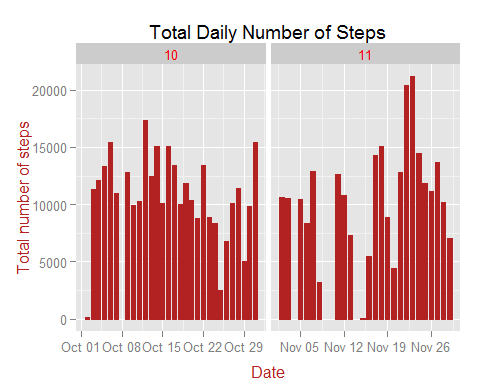
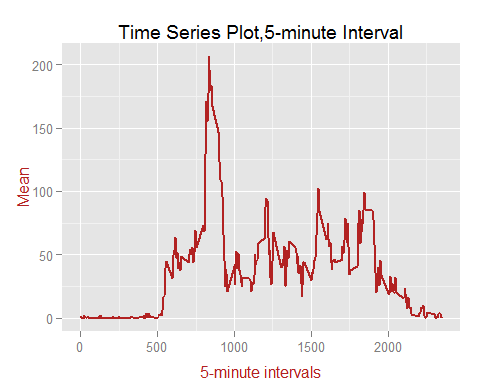
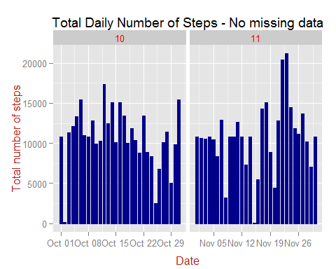
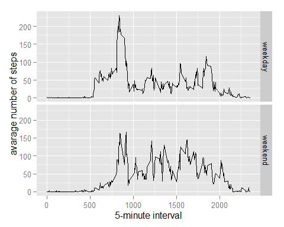

# Reproducible Research: Peer Assessment 1

This assignment makes use of following libraries:

```r
library(ggplot2); library(scales); library(Hmisc); library(devtools);require(ggplot2);require(easyGgplot2);require(grid)
```

```
## Loading required package: grid
## Loading required package: lattice
## Loading required package: survival
## Loading required package: Formula
## 
## Attaching package: 'Hmisc'
## 
## The following objects are masked from 'package:base':
## 
##     format.pval, round.POSIXt, trunc.POSIXt, units
## 
## Loading required package: easyGgplot2
## Loading required package: plyr
## 
## Attaching package: 'plyr'
## 
## The following objects are masked from 'package:Hmisc':
## 
##     is.discrete, summarize
```
#Loading and processing the Data
## 1 -  Load the data

```r
getwd()
```

```
## [1] "C:/Users/me/Desktop/RepData_PeerAssessment1"
```

```r
#setwd("c:/Users/me/Desktop/RR/RepData_PeerAssessment1")
```
The following code unzips the data and reads it into the raw data set. 

```r
if(!file.exists('activity.csv')){
    unzip('activity.zip')
}

#Sampling DataSet
sampleData <- read.csv("activity.csv", header = TRUE, nrows = 20)
head(sampleData, n=3)
```

```
##   steps       date interval
## 1    NA 2012-10-01        0
## 2    NA 2012-10-01        5
## 3    NA 2012-10-01       10
```

```r
tail(sampleData, n=3)
```

```
##    steps       date interval
## 18    NA 2012-10-01      125
## 19    NA 2012-10-01      130
## 20    NA 2012-10-01      135
```

```r
myDat <- read.csv("activity.csv", colClasses = c("integer", "Date", "factor"))
describe(myDat)
```

```
## myDat 
## 
##  3  Variables      17568  Observations
## ---------------------------------------------------------------------------
## steps 
##       n missing  unique    Info    Mean     .05     .10     .25     .50 
##   15264    2304     617    0.62   37.38     0.0     0.0     0.0     0.0 
##     .75     .90     .95 
##    12.0    86.0   252.8 
## 
## lowest :   0   1   2   3   4, highest: 786 789 794 802 806 
## ---------------------------------------------------------------------------
## date 
##       n missing  unique 
##   17568       0      61 
## 
## lowest : 2012-10-01 2012-10-02 2012-10-03 2012-10-04 2012-10-05
## highest: 2012-11-26 2012-11-27 2012-11-28 2012-11-29 2012-11-30 
## ---------------------------------------------------------------------------
## interval 
##       n missing  unique 
##   17568       0     288 
## 
## lowest : 0    10   100  1000 1005, highest: 935  940  945  950  955  
## ---------------------------------------------------------------------------
```
## 2 - Process/transform the data into a format suitable for your analysis

```r
# Removing entries with NA
cleanDat<- na.omit(myDat)
#testing, missing must be 0
describe(cleanDat)
```

```
## cleanDat 
## 
##  3  Variables      15264  Observations
## ---------------------------------------------------------------------------
## steps 
##       n missing  unique    Info    Mean     .05     .10     .25     .50 
##   15264       0     617    0.62   37.38     0.0     0.0     0.0     0.0 
##     .75     .90     .95 
##    12.0    86.0   252.8 
## 
## lowest :   0   1   2   3   4, highest: 786 789 794 802 806 
## ---------------------------------------------------------------------------
## date 
##       n missing  unique 
##   15264       0      53 
## 
## lowest : 2012-10-02 2012-10-03 2012-10-04 2012-10-05 2012-10-06
## highest: 2012-11-25 2012-11-26 2012-11-27 2012-11-28 2012-11-29 
## ---------------------------------------------------------------------------
## interval 
##       n missing  unique 
##   15264       0     288 
## 
## lowest : 0    10   100  1000 1005, highest: 935  940  945  950  955  
## ---------------------------------------------------------------------------
```

```r
 #Grouping information per date (month added).
cleanDat$month <- as.numeric(format(cleanDat$date, '%m'))
dim(cleanDat)
```

```
## [1] 15264     4
```

```r
head(cleanDat)
```

```
##     steps       date interval month
## 289     0 2012-10-02        0    10
## 290     0 2012-10-02        5    10
## 291     0 2012-10-02       10    10
## 292     0 2012-10-02       15    10
## 293     0 2012-10-02       20    10
## 294     0 2012-10-02       25    10
```

#What is mean total number of steps taken per day?
## 1 - Calculate the total number of steps taken per day and
## 2 - Make a histogram of the total number of steps taken each day

The histogram addresses 1 and 2 and shows the number of steps per day

```r
library(ggplot2)
p<-ggplot(cleanDat, aes(date, steps)) + 
geom_histogram(stat = "identity", colour = "firebrick", fill = "firebrick", width = 0.7,position = "stack") + 
facet_grid(. ~ month, scales = "free") +
theme(strip.text.x = element_text(size = 10, colour = "red", angle = 0))+
labs(title = "Total Daily Number of Steps", 
x = "Date", y = "Total number of steps")
p + theme(
    axis.title.x = element_text(color="firebrick", vjust=-0.35),
    axis.title.y = element_text(color="firebrick" , vjust=0.35)
          )
```

 

## 3 - Calculate and report the mean and the median of the total number of steps taken per day

```r
## Groups and adds steps per date into a list  
Steps <- aggregate(cleanDat$steps, list(Date = cleanDat$date), FUN = "sum")$x
Steps
```

```
##  [1]   126 11352 12116 13294 15420 11015 12811  9900 10304 17382 12426
## [12] 15098 10139 15084 13452 10056 11829 10395  8821 13460  8918  8355
## [23]  2492  6778 10119 11458  5018  9819 15414 10600 10571 10439  8334
## [34] 12883  3219 12608 10765  7336    41  5441 14339 15110  8841  4472
## [45] 12787 20427 21194 14478 11834 11162 13646 10183  7047
```

```r
mean(Steps,na.rm=TRUE)
```

```
## [1] 10766.19
```

```r
median(Steps, na.rm=TRUE)
```

```
## [1] 10765
```

#What is the average daily activity pattern?
## 1 - Make a time series plot (i.e. type = "l") of the 5-minute interval (x-axis) and the average number of steps taken, averaged across all days (y-axis)

```r
Mymean <- aggregate(cleanDat$steps, 
list(interval = as.numeric(as.character(cleanDat$interval))), FUN = "mean")
names(Mymean) = c("Interval", "Mean")

q <- ggplot(Mymean, aes(Interval, Mean)) + 
geom_line(color = "firebrick", size = 0.8) + 
labs(title = "Time Series Plot,5-minute Interval", 
x = "5-minute intervals", y = "Mean")
q + theme(
    axis.title.x = element_text(color="firebrick", vjust=-0.35),
    axis.title.y = element_text(color="firebrick" , vjust=0.35)
          )
```

 

## 2 - Which 5-minute interval, on average across all the days in the dataset, contains the maximum number of steps?

```r
Mymean[Mymean$Mean == max(Mymean$Mean), ]
```

```
##     Interval     Mean
## 104      835 206.1698
```

#Imputing missing values
## 1 - Calculate and reprot the total number of missing values in the dataset (i.e totalnumber of rows with NAs)

```r
sum(is.na(myDat))
```

```
## [1] 2304
```

## 2. Devise a startegy for filling in all of the missing values in the dataset.

```r
# My strategy is to use the mean for that 5-minute interval to fill each NA value in the steps column.

imputed <- myDat
imputed = data.frame(myDat)
head(imputed, n=3)
```

```
##   steps       date interval
## 1    NA 2012-10-01        0
## 2    NA 2012-10-01        5
## 3    NA 2012-10-01       10
```

## 3 - Create a new dataset that is equal to the original dataset but with the missing data filled in.

```r
for (i in 1:nrow(imputed)) {
    if (is.na(imputed$steps[i])) {
        imputed$steps[i] <- Mymean[which(imputed$interval[i] == Mymean$Interval), ]$Mean
    }
}
head(imputed, n=3); tail(imputed, n=3)
```

```
##       steps       date interval
## 1 1.7169811 2012-10-01        0
## 2 0.3396226 2012-10-01        5
## 3 0.1320755 2012-10-01       10
```

```
##           steps       date interval
## 17566 0.6415094 2012-11-30     2345
## 17567 0.2264151 2012-11-30     2350
## 17568 1.0754717 2012-11-30     2355
```

```r
describe (imputed) #no missing data
```

```
## imputed 
## 
##  3  Variables      17568  Observations
## ---------------------------------------------------------------------------
## steps 
##       n missing  unique    Info    Mean     .05     .10     .25     .50 
##   17568       0     869    0.74   37.38    0.00    0.00    0.00    0.00 
##     .75     .90     .95 
##   27.00   84.87  193.65 
## 
## lowest :   0.00000   0.07547   0.11321   0.13208   0.15094
## highest: 786.00000 789.00000 794.00000 802.00000 806.00000 
## ---------------------------------------------------------------------------
## date 
##       n missing  unique 
##   17568       0      61 
## 
## lowest : 2012-10-01 2012-10-02 2012-10-03 2012-10-04 2012-10-05
## highest: 2012-11-26 2012-11-27 2012-11-28 2012-11-29 2012-11-30 
## ---------------------------------------------------------------------------
## interval 
##       n missing  unique 
##   17568       0     288 
## 
## lowest : 0    10   100  1000 1005, highest: 935  940  945  950  955  
## ---------------------------------------------------------------------------
```

```r
sum(is.na(imputed))
```

```
## [1] 0
```

## 4. Make a histogram of the total number of steps taken each day and Calculate and report the mean and median total number of steps taken per day. Do these values differ from the estimates from the first part of the assignment? What is the impact of imputing missing data on the estimates of the total daily number of steps?


```r
head(imputed)
```

```
##       steps       date interval
## 1 1.7169811 2012-10-01        0
## 2 0.3396226 2012-10-01        5
## 3 0.1320755 2012-10-01       10
## 4 0.1509434 2012-10-01       15
## 5 0.0754717 2012-10-01       20
## 6 2.0943396 2012-10-01       25
```

```r
head(cleanDat)
```

```
##     steps       date interval month
## 289     0 2012-10-02        0    10
## 290     0 2012-10-02        5    10
## 291     0 2012-10-02       10    10
## 292     0 2012-10-02       15    10
## 293     0 2012-10-02       20    10
## 294     0 2012-10-02       25    10
```

```r
imputed$month <- as.numeric(format(imputed$date, '%m'))
dim(cleanDat)
```

```
## [1] 15264     4
```

```r
head(cleanDat)
```

```
##     steps       date interval month
## 289     0 2012-10-02        0    10
## 290     0 2012-10-02        5    10
## 291     0 2012-10-02       10    10
## 292     0 2012-10-02       15    10
## 293     0 2012-10-02       20    10
## 294     0 2012-10-02       25    10
```

```r
library(ggplot2)
p1<-ggplot(imputed, aes(date, steps)) + 
geom_histogram(stat = "identity", colour = "dark blue", fill = "dark blue", width = 0.7,position = "stack") + 
facet_grid(. ~ month, scales = "free") +
theme(strip.text.x = element_text(size = 10, colour = "red", angle = 0))+
labs(title = "Total Daily Number of Steps - No missing data", 
x = "Date", y = "Total number of steps")

p1 + theme(
    axis.title.x = element_text(color="firebrick", vjust=-0.35),
    axis.title.y = element_text(color="firebrick" , vjust=0.35)
          )
```

 


```r
##Mean total number of steps taken per day (no missing Data):
NewSteps <- aggregate(imputed$steps, list(Date = imputed$date), FUN = "sum")$x
newMean <- mean(NewSteps)
newMean    
```

```
## [1] 10766.19
```

```r
##Median total number of steps taken per day (no missing data):
newMedian <- median(NewSteps)
newMedian
```

```
## [1] 10766.19
```

```r
##Compare them with the two before imputing missing data:

PrevMean <- mean(Steps)
PrevMedian <- median(Steps)
newMean - PrevMean
```

```
## [1] 0
```

```r
newMedian - PrevMedian
```

```
## [1] 1.188679
```
Note that after imputing the missing data, the new mean of total steps taken per day is the same as that of the old mean.

#Are there differences in activity patterns between weekdays and weekends?

For this part the weekdays() function may be some help here.
Use the datset with filled-in missing values for this part.

## 1 - Create a new factor variable in the dataset with two levels -"weekday" and "weekend" indicating wheter a give date is a weekday or weekend day.

```r
imputed$weekdays <- factor(format(imputed$date, "%A"))

levels(imputed$weekdays) <- list(weekday = c("Monday", "Tuesday",                                            "Wednesday", "Thursday", "Friday"), weekend = c("Saturday", "Sunday"))
 describe (imputed)
```

```
## imputed 
## 
##  5  Variables      17568  Observations
## ---------------------------------------------------------------------------
## steps 
##       n missing  unique    Info    Mean     .05     .10     .25     .50 
##   17568       0     869    0.74   37.38    0.00    0.00    0.00    0.00 
##     .75     .90     .95 
##   27.00   84.87  193.65 
## 
## lowest :   0.00000   0.07547   0.11321   0.13208   0.15094
## highest: 786.00000 789.00000 794.00000 802.00000 806.00000 
## ---------------------------------------------------------------------------
## date 
##       n missing  unique 
##   17568       0      61 
## 
## lowest : 2012-10-01 2012-10-02 2012-10-03 2012-10-04 2012-10-05
## highest: 2012-11-26 2012-11-27 2012-11-28 2012-11-29 2012-11-30 
## ---------------------------------------------------------------------------
## interval 
##       n missing  unique 
##   17568       0     288 
## 
## lowest : 0    10   100  1000 1005, highest: 935  940  945  950  955  
## ---------------------------------------------------------------------------
## month 
##       n missing  unique    Info    Mean 
##   17568       0       2    0.75   10.49 
## 
## 10 (8928, 51%), 11 (8640, 49%) 
## ---------------------------------------------------------------------------
## weekdays 
##       n missing  unique 
##   17568       0       2 
## 
## weekday (12960, 74%), weekend (4608, 26%) 
## ---------------------------------------------------------------------------
```

## 2 - Make a panel plot containing a time series plot (i.e. type = "l") of the 5-minute interval (x-axis) and the average number of steps taken, averaged across all weekday days or weekend days (y-axis).

```r
Mymean <- aggregate(imputed$steps,list(interval = as.numeric(as.character(imputed$interval)), weekdays = imputed$weekdays),FUN = "mean")
names(Mymean)[3] <- "mean"
head(Mymean)
```

```
##   interval weekdays       mean
## 1        0  weekday 2.25115304
## 2        5  weekday 0.44528302
## 3       10  weekday 0.17316562
## 4       15  weekday 0.19790356
## 5       20  weekday 0.09895178
## 6       25  weekday 1.59035639
```

```r
ggplot(Mymean, aes(interval, mean)) + 
    geom_line() + 
    facet_grid(weekdays ~ .) +
    xlab("5-minute interval") + 
    ylab("avarage number of steps")
```

 
      
